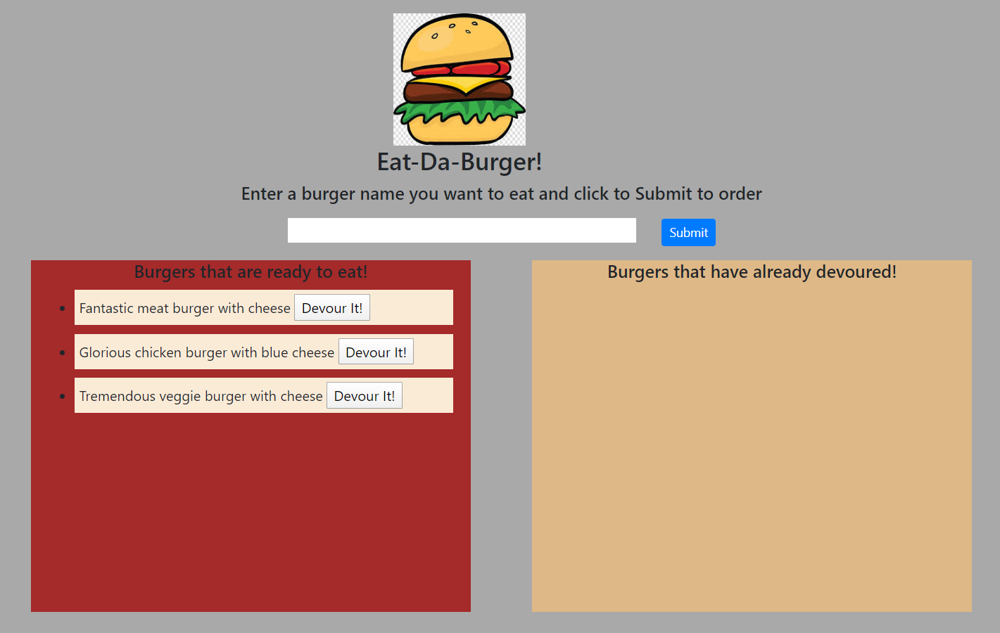
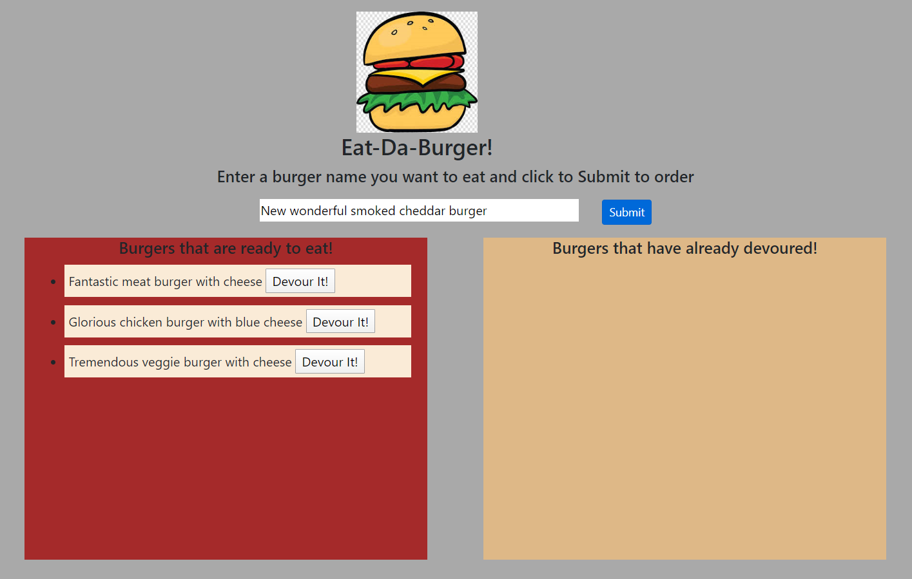
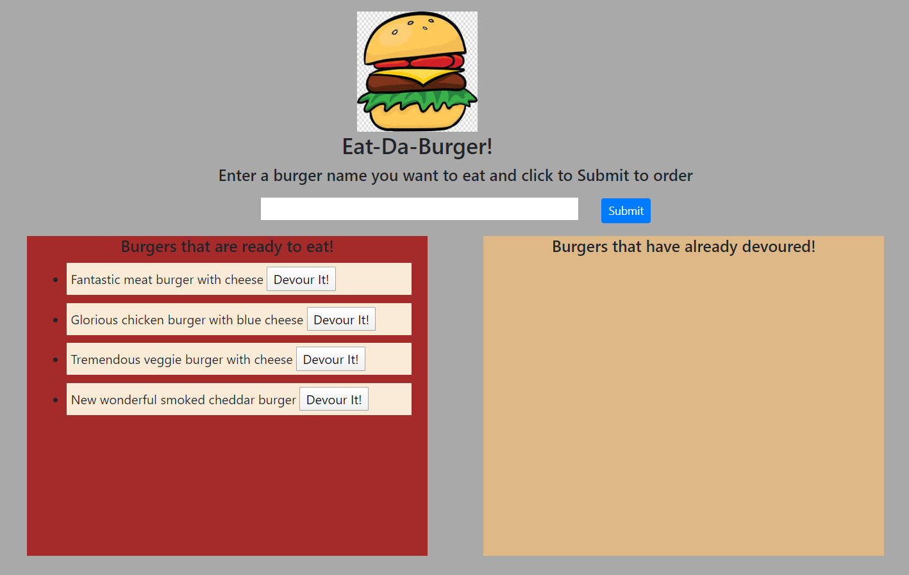
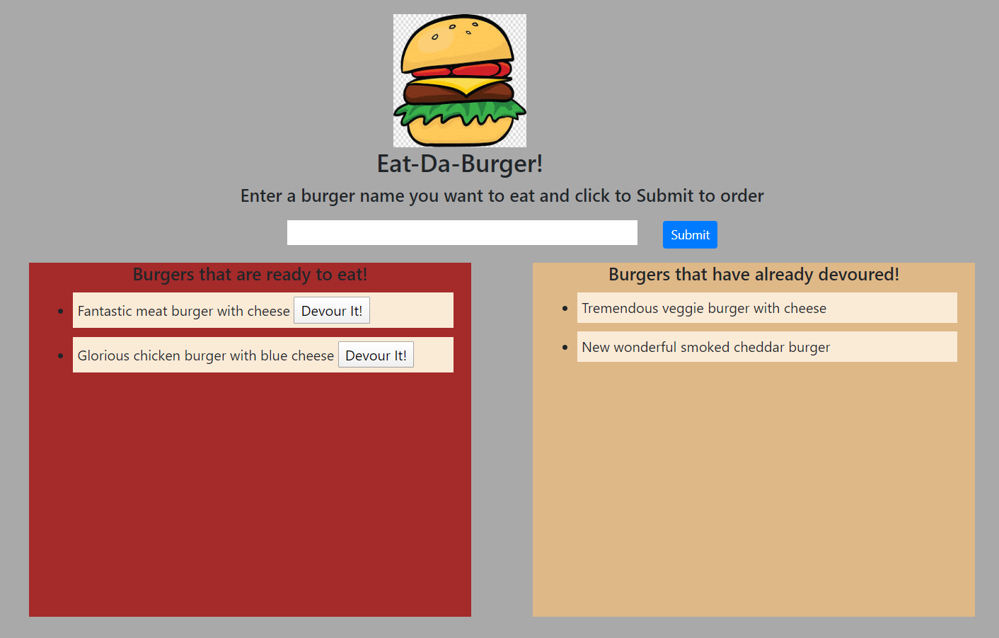

# Burger

## Unit 13 MVC Homework : Node Express Handlebars

This is a Node Express Handlebars application which can be invoked with the following code. 

```sh
npm start
```

Heroku hosting path is as below
https://pure-beyond-13416.herokuapp.com/

Application starts with getting earlier created items from database.


User can create his/her own burger by entering the name of the new burger in to the input area.


Once submitting "Submit" button new burger will be added to ready to eat box.




When user click on "Devour it!" button, ready to eat item moves to already devoured box.  
